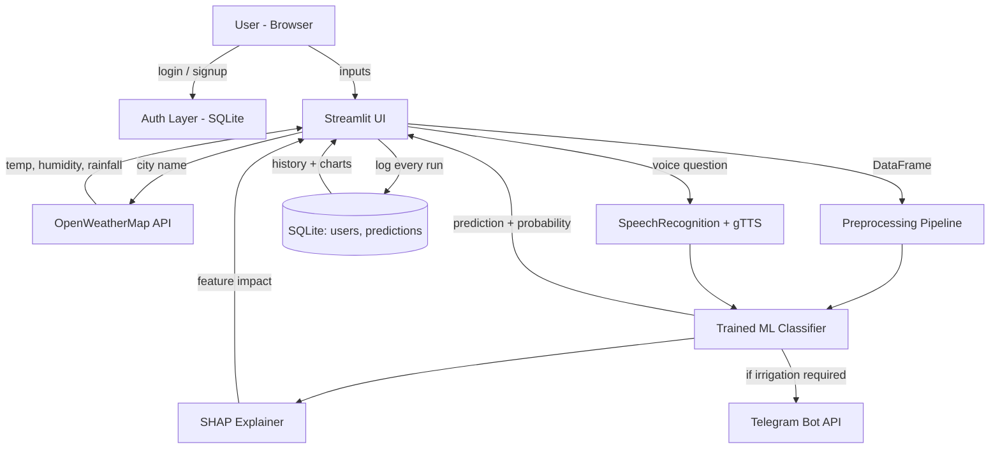

# 🌱 Smart Crop Monitoring System

AI-powered irrigation prediction with Explainable AI, per-user accounts,
Telegram alerts, a voice assistant, live weather auto-fetch, and a
prediction history dashboard — built with Python and Streamlit.

**Live demo:** https://smart-crop-monitoring-mpbhpxpwniuto5kv2ygto4.streamlit.app

---

## Features

- 🔐 **User accounts** — sign up / log in (SQLite-backed, salted password hashing)
- 💧 **Irrigation prediction** — ML model + probability score
- 🧠 **Explainable AI** — SHAP shows *why* the model made its decision
- ☁️ **Live weather auto-fetch** — pulls temperature/humidity/rainfall for a city (OpenWeatherMap)
- 📱 **Telegram alerts** — irrigation notifications sent to your connected account
- 🎙️ **Voice assistant** — ask irrigation questions by speech, get spoken answers
- 📊 **History & Analytics** — every prediction is logged per user, with charts and CSV export
- 🌐 **Bilingual** — full English / हिंदी toggle
- 🐳 **Dockerized**, with automated tests and CI on every push

---

## Architecture



---

## Project structure

```
.
├── app.py                  # Main Streamlit application
├── database.py             # SQLite: users, telegram binding, prediction history
├── weather.py               # OpenWeatherMap API wrapper
├── train_model.py           # Script to retrain irrigation_model.pkl on real data
├── irrigation_model.pkl     # Trained scikit-learn pipeline (preprocessing + classifier)
├── requirements.txt
├── Dockerfile
├── .streamlit/
│   └── config.toml          # Theme (green agri palette)
├── tests/
│   ├── test_database.py
│   └── test_weather.py
└── .github/workflows/ci.yml # Runs pytest on every push
```

---

## Setup

### 1. Clone and install

```bash
git clone https://github.com/chkartik16/2025-2029.git
cd <project-folder>
pip install -r requirements.txt
```

### 2. Configure secrets

Create `.streamlit/secrets.toml` (never commit this file):

```toml
TELEGRAM_BOT_TOKEN = "your-bot-token-from-BotFather"
OPENWEATHER_API_KEY = "your-key-from-openweathermap.org"
```

`OPENWEATHER_API_KEY` is optional — if it's missing, the app still
works, the weather auto-fetch button just shows a friendly warning.

### 3. Run locally

```bash
streamlit run app.py
```

### 4. Run tests

```bash
pytest tests/ -v
```

### 5. Run with Docker (optional)

```bash
docker build -t smart-crop-monitoring .
docker run -p 8501:8501 smart-crop-monitoring
```

---

## Retraining the model

`irrigation_model.pkl` was trained on a small dataset. To retrain on a
real, larger dataset (recommended before using this for anything beyond
a prototype):

1. Get a real irrigation dataset (see suggestions inside `train_model.py`)
2. Save it as `dataset.csv` next to `train_model.py`
3. Run:
   ```bash
   python train_model.py
   ```

This prints cross-validation accuracy, a classification report and a
confusion matrix, then overwrites `irrigation_model.pkl`.

---

## Tech stack

Python · Streamlit · scikit-learn · SHAP · SQLite · OpenWeatherMap API ·
Telegram Bot API · SpeechRecognition · gTTS · Pydub · pytest · Docker ·
GitHub Actions

---

## Limitations

This is a machine-learning prototype. Predictions should not replace
professional agricultural advice — always validate against real field
conditions and local agronomic guidance.

## Future scope

- IoT soil-moisture / temperature sensors for live field data
- Automatic irrigation pump control
- Support for additional crop types
- Native mobile app (PWA)

## License

MIT — feel free to fork and adapt for your own use.
